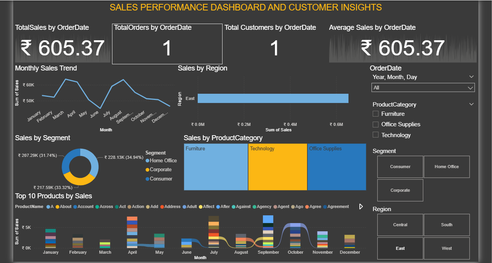

# 📊 Sales Performance Dashboard

This is an end-to-end data analytics project where I created a **Sales Performance Dashboard** and derived **Customer Insights** using **Python, Excel, SQL, and Power BI**.

## 🔍 Project Overview

The goal of this project is to analyze historical sales data, uncover business insights, and build an interactive dashboard for decision-makers.

## 🛠️ Tools & Technologies

- **Python (Pandas, Matplotlib)** – Data Cleaning & Exploratory Data Analysis
- **MySQL** – Storing and querying cleaned data
- **Excel** – Preliminary data formatting
- **Power BI** – Dashboard creation and data visualization

## 📈 Key Insights

- Top-performing products and categories
- Monthly revenue trends
- Customer segmentation by region and spend
- Sales by payment method

## 📂 Files Included

- `sales_data.ipynb` – Python notebook for data cleaning
- `Cleaned_Sales_Data_by_python.csv` – Final cleaned dataset
- `Sales Performance_Customer Insights.pbix` – Power BI dashboard
- `README.md` – Project summary and documentation

## 🔗 GitHub Link

> [👉 View Project on GitHub](https://github.com/RAVELLANAGARUNA/Sales-Dashboard)

## 🙋 About Me

I'm **R. Nagarjuna**, a passionate Data Analyst skilled in Python, SQL, Excel, and Power BI.  
📩 Email: arjunravella108@gmail.com  
📱 Phone: 7095740732  
🔗 [LinkedIn](https://www.linkedin.com/in/Nagarjuna )

## 📷 Dashboard Preview

